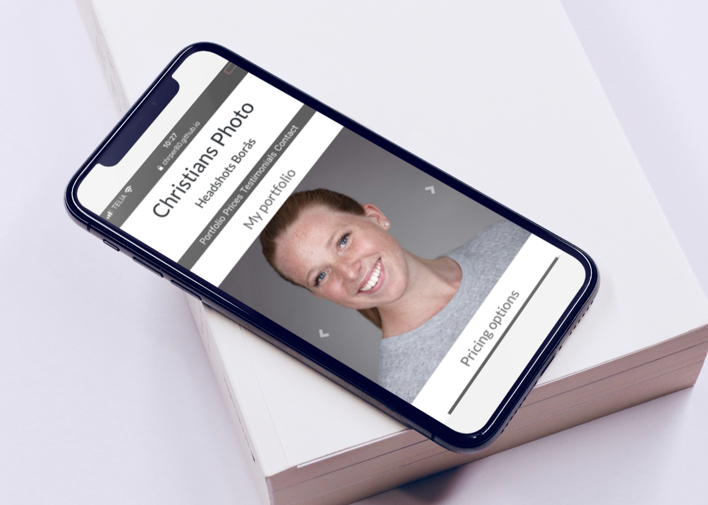
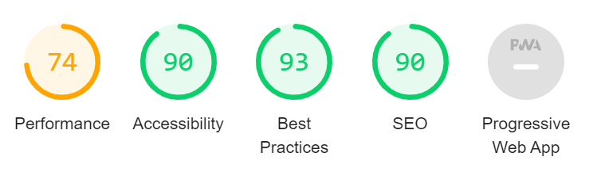

# Website for headshot photography business "Christians Photo"

## About

### The idea

For my **first milestone project** i wanted to make a website that i can use for my **headshots business**. The reason for this is that i have many nice pictures that i can use for free. The images are from my portfolio and the people in there have all given their written permission that i can use the images for portfolio and social media. 

### The business

The business is a small one, just me. The people that would be interested in my services are actors, professionals with a LinkedIn profile, writers, journalists and maybe even people active on dating sites. For example, an actor need to showcase him/her when applying for jobs, so they need good headshots. 

#### Company Goals and needs

For the company, it´s about showcasing the images and attract new clients. I want to show them i take good images, that other people like what i do and that i am worthy of their trust.

#### Client goals and needs

There are loads of photographers out there. When potential clients come to my site, they need to be able to form an opinion on how good images i take and how my prices compare to the competition. It´s also important that they can see where i am located. Those things in particular need to be very visible to them.

### Wireframes

[Follow this link to look at my wireframes](https://xd.adobe.com/view/a0422fe8-1a03-4167-9142-6dcc7f854fcb-f511/)

### Features

Potential clients can look at my work and book a session. They can also contact me via email, phone or reach out on social media. 

### Accessibility

To make it as accessible as possible i use alt text for the images and i tried to make it clean and high contrast.

### Design

Within the headshot business, it´s common to use a one-page site. I wanted the site to look clean and professional, trustworthy. I think that the font **Lato**, is giving a professional, not to shouty, friendly and professional impression.

## Manual testing procedures

I have been using the Google Chrome dev tools to make sure the site looks good on different devices/screens. I designed the page to be optimized at the dev tools breakpoints and i also looked at what intervals it didn´t look so good in and then added a media querie there. 

I have tested the functionality myself and i also asked my girlfriend to try it out. 

I also used Lighthouse in dev tools. It gave me the information that my performance is at 74, and that i could take a look at the sizing of images. When we try it out on different devices it´s quick enough, so for now i let it be. The image sizing and best practice with images is something i will have a look at more in depth for future projects.

### Header menu

The links in the menu is supposed to take the user to different sections on the site. They work as expected when tested. 

### Portfolio carousel

It´s supposed to go around by itself like a carousel, and it does. We have also tried out the controls to see if they take the user manually from image to image as they should. They do that.

### Pricing card buttons

These buttons will take the user to external booking pages, one for each package. They worked as they should when we tested. The external booking i use is called [Accuity scheduling](https://acuityscheduling.com/?kw=YToxOTMzNDMwNg%3D%3D).

### The contact form

I put required on all the fields and the consent checkbox. Everything works as it should and if something is missing there will come a little pop up message. I used the same url that you guys used to dump the info in the form. 

### Footer links

There is a navigation menu, a contact menu and links to social media. When tested, they worked fine.

### Bugs

I validated the code in [Jigsaw](https://jigsaw.w3.org/css-validator/) for the css, and the [W3c markup validation service](https://validator.w3.org/) for the html. When i validated the html code, i got an error that i can't use the a element inside the button element. It worked fine and looked good, but i had to change it. I then used a div element with the a element as child. It worked fine, but i had to do some steps to make it work. The div element is a block level element so had to give it a proper width, because it takes all of the available space if i don't. I also had to center it with margin: 0 auto.

## Deployment

### Signing up to Github

1. Go to [github.com](https://github.com/)
2. Sign up
3. Github will now create your account
4. Choose a plan
5. Verify your email

### Installing the chrome extension

To make life easier, install [this Gitpod browser extension](https://chrome.google.com/webstore/detail/gitpod-dev-environments-i/dodmmooeoklaejobgleioelladacbeki) in your Chrome browser.

### Creating a new Gitpod workspace and start coding

1. Go to the [repo](https://github.com/chrper80/Milestone-project1)
2. Click the green button with "Gitpod" written on it
3. A new Gitpod workspace will now be created
4. Copy the source code and paste it in your new workspace

### Getting back to your workspace

Don´t use the green button more then once, because every time you push it, a new workspace will be created. Go via the [Gitpod page](https://www.gitpod.io/).

### Saving to Github via the cli

1. Write: git add, followed by the file you want to add
2. Write: git commit -m "text that describes what changes you made"
3. Write: git push, and it will be delivered to github

### Deployment of the site on Githup Pages

1. Go to the [Github repo](https://github.com/chrper80/Milestone-project1)
2. Go to settings
3. Go down to Github pages
4. Choose the master branch and save
5. It can be a little slow to build the page, so don´t worry if it takes 15 min or more
6. Sometimes it can need a little "kick". I learned from a tutor to use this command in Gitpod cli: git commit -m "Restarting GH Pages build" --allow-empty. It makes Github start building the page again

## Acknowledgements

The portfolio carousel is just copy pasted from [Bootstrap](https://getbootstrap.com/docs/4.5/components/carousel/).

[Google maps](https://www.google.se/maps/place/Norra+Sj%C3%B6bogatan+34,+506+43+Bor%C3%A5s/@57.7522864,12.9419388,17z/data=!3m1!4b1!4m5!3m4!1s0x465aa72b07460935:0xad92acce2e44efd9!8m2!3d57.7522864!4d12.9441275) is where i found the code with the map i use to show the studio location.

I have also used fonts from [Google fonts](https://fonts.google.com/) and icons from [Font awsome](https://fontawesome.com/).

My mentor [Excellence Ilesanmi](https://github.com/lon-io), has done a great job in helping me in a good way. The mentoring sessions has been really helpful!

I would also like to thank the tutors for their patience with me. They are always helpful and all of them seem to have a great sense of humour!

The people hanging out on Slack has also been very helpful.
  
 

